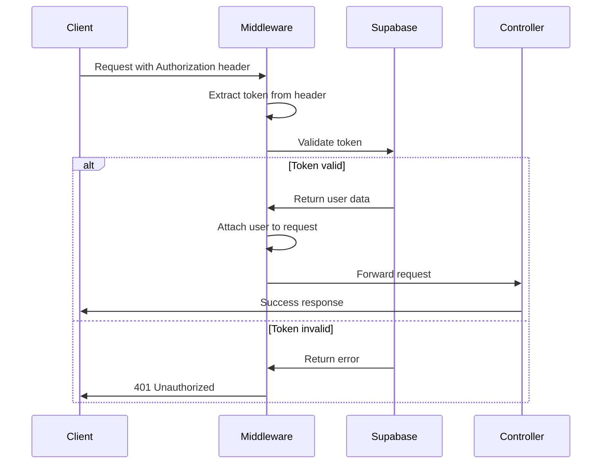

## Overview

The CONIITI 2026 backend uses **Supabase Authentication** with JWT (JSON Web Tokens) for securing endpoints. The `authMiddleware` validates tokens and attaches user information to requests.

## Authentication Middleware

**Source:** `src/middleware/auth.middleware.ts`

```typescript
import { Request, Response, NextFunction } from 'express'
import { admin_supabase } from '../config/supabase'

export const authMiddleware = async (
  req: Request,
  res: Response,
  next: NextFunction
) => {
  try {
    const authHeader = req.headers.authorization

    if (!authHeader) {
      return res.status(401).json({ error: 'Token requerido' })
    }

    const token = authHeader.split(' ')[1]

    const { data, error } = await admin_supabase.auth.getUser(token)

    if (error || !data.user) {
      return res.status(401).json({ error: 'Token inválido' })
    }

    // Attach user to request
    ;(req as any).user = data.user

    next()
  } catch {
    res.status(401).json({ error: 'No autorizado' })
  }
}
```

## How It Works

The authentication middleware follows this flow:



### Step-by-Step Process

1. **Extract Authorization Header**
   ```typescript
   const authHeader = req.headers.authorization
   if (!authHeader) {
     return res.status(401).json({ error: 'Token requerido' })
   }
   ```
   The middleware checks if the `Authorization` header exists in the request.

2. **Parse Bearer Token**
   ```typescript
   const token = authHeader.split(' ')[1]
   ```
   Extracts the token from the `Bearer <token>` format.

3. **Validate with Supabase**
   ```typescript
   const { data, error } = await admin_supabase.auth.getUser(token)
   ```
   Uses the admin Supabase client to validate the JWT token and retrieve user data.

4. **Attach User to Request**
   ```typescript
   ;(req as any).user = data.user
   ```
   If validation succeeds, attaches the user object to the request for use in controllers.

5. **Continue or Reject**
   - **Success:** Calls `next()` to proceed to the controller
   - **Failure:** Returns 401 with error message

## Using Authentication in Routes

### Protecting Endpoints

Apply `authMiddleware` to routes that require authentication:

```typescript
import { Router } from 'express'
import { authMiddleware } from '../../middleware/auth.middleware'
import * as controller from './controller'

const router = Router()

// Public route - no authentication
router.get('/public', controller.publicHandler)

// Protected route - requires authentication
router.get('/private', authMiddleware, controller.protectedHandler)

// Multiple protected routes
router.post('/', authMiddleware, controller.create)
router.put('/:id', authMiddleware, controller.update)
router.delete('/:id', authMiddleware, controller.remove)

export default router
```

### Real Example: User Routes

**Source:** `src/modules/usuario/usuario.routes.ts`

```typescript
import { Router } from 'express'
import { authMiddleware } from '../../middleware/auth.middleware'
import * as controller from './usuario.controller'

const router = Router()

// Public: User registration
router.post('/register', controller.registerUser)

// Protected: Profile operations
router.get('/perfil', authMiddleware, controller.obtenerPerfil)
router.post('/perfil', authMiddleware, controller.crearPerfil)
router.put('/perfil', authMiddleware, controller.actualizarPerfil)
router.get('/', authMiddleware, controller.obtenerUsuarios)

export default router
```

**Pattern:**
- Registration is public (no middleware)
- Profile operations require authentication (with middleware)

## Accessing User Data in Controllers

Once authenticated, controllers can access user information from the request:

```typescript
import { Request, Response } from 'express'
import * as service from './service'

export const obtenerPerfil = async (req: Request, res: Response) => {
  // Access authenticated user ID
  const userId = (req as any).user.id
  
  const { data, error } = await service.obtenerMiPerfil(userId)
  
  if (error) return res.status(400).json({ error: error.message })
  res.json(data)
}
```

**Available User Properties:**

```typescript
(req as any).user = {
  id: 'uuid',
  email: 'user@example.com',
  role: 'authenticated',
  aud: 'authenticated',
  created_at: '2024-01-01T00:00:00.000Z',
  // ... other Supabase user properties
}
```

## Client-Side Authentication

Clients must include the JWT token in the `Authorization` header:

### Header Format

```
Authorization: Bearer <jwt_token>
```

### Example: Fetch API

```javascript
const token = 'user_jwt_token_here'

fetch('http://localhost:3000/api/usuarios/perfil', {
  method: 'GET',
  headers: {
    'Authorization': `Bearer ${token}`,
    'Content-Type': 'application/json'
  }
})
  .then(res => res.json())
  .then(data => console.log(data))
```

### Example: Axios

```javascript
import axios from 'axios'

const token = 'user_jwt_token_here'

axios.get('http://localhost:3000/api/usuarios/perfil', {
  headers: {
    'Authorization': `Bearer ${token}`
  }
})
  .then(res => console.log(res.data))
```

### Example: Supabase Client

When using Supabase client on the frontend:

```javascript
import { createClient } from '@supabase/supabase-js'

const supabase = createClient(SUPABASE_URL, SUPABASE_ANON_KEY)

// Get session token
const { data: { session } } = await supabase.auth.getSession()
const token = session?.access_token

// Use token in API requests
fetch('http://localhost:3000/api/usuarios/perfil', {
  headers: {
    'Authorization': `Bearer ${token}`
  }
})
```

## Error Responses

The middleware returns specific error responses:

### 401: No Token Provided

```json
{
  "error": "Token requerido"
}
```

**Cause:** No `Authorization` header in request

### 401: Invalid Token

```json
{
  "error": "Token inválido"
}
```

**Causes:**
- Token expired
- Token malformed
- Token revoked
- Invalid signature

### 401: Unauthorized (Catch-all)

```json
{
  "error": "No autorizado"
}
```

**Cause:** Unexpected error during validation

## User Registration Flow

The registration process creates both an auth user and a profile record:

**Source:** `src/modules/usuario/usuario.controller.ts:8-85`

```typescript
export const registerUser = async (req: Request, res: Response) => {
  const { fullName, email, password, rol, career, gender, documentNumber, institutionalCode } = req.body

  try {
    // 1. Validate document number uniqueness
    if (documentNumber) {
      const { data: docExists } = await admin_supabase
        .from('perfil_usuario')
        .select('id')
        .eq('documento', documentNumber)
        .maybeSingle()

      if (docExists) {
        return res.status(400).json({ 
          error: "El número de documento ya se encuentra registrado." 
        })
      }
    }

    // 2. Create user in Supabase Auth
    const { data, error } = await admin_supabase.auth.signUp({
      email,
      password,
    })

    if (error || !data.user) {
      return res.status(400).json({ 
        error: error?.message || "No se pudo crear el usuario en Auth" 
      })
    }

    // 3. Create profile in database
    const { error: profileError } = await admin_supabase
      .from('perfil_usuario')
      .insert({
        id: data.user.id,
        nombre_completo: fullName,
        email: email,
        rol: rol || 'USER',
        carrera: career,
        genero: gender,
        documento: documentNumber,
        codigo_institucional: institutionalCode
      })

    if (profileError) {
      // Rollback: Delete auth user if profile creation fails
      await admin_supabase.auth.admin.deleteUser(data.user.id)
      return res.status(400).json({ 
        error: "Error al crear el perfil: " + profileError.message 
      })
    }

    return res.status(201).json({
      message: "Usuario y perfil creados correctamente",
      user: {
        id: data.user.id,
        email: data.user.email,
        fullName
      }
    })
  } catch (err: any) {
    return res.status(500).json({ error: "Error interno del servidor" })
  }
}
```

**Key Steps:**
1. Validate unique constraints (document, institutional code)
2. Create authentication user via `admin_supabase.auth.signUp()`
3. Create profile record in `perfil_usuario` table
4. Rollback auth user if profile creation fails
5. Return success with user data

## Why Admin Client?

The middleware uses `admin_supabase` instead of the regular `supabase` client:

```typescript
import { admin_supabase } from '../config/supabase'
```

**Reasons:**
1. **Service Role Key:** Can validate tokens server-side
2. **Bypass RLS:** Access user data regardless of Row Level Security policies
3. **Admin Operations:** Perform administrative auth operations
4. **User Validation:** Call `auth.getUser()` to validate any token

See [Supabase Integration](/development/backend/supabase-integration) for details on client setup.

## Security Considerations

<Warning>
  **Never expose tokens in logs, error messages, or client responses.** Always handle tokens securely.
</Warning>

### Best Practices

<AccordionGroup>
  <Accordion title="Use HTTPS in Production">
    Always use HTTPS to prevent token interception:
    ```bash
    # Production URL
    https://api.coniiti.com
    
    # Development (HTTP acceptable)
    http://localhost:3000
    ```
  </Accordion>

  <Accordion title="Set Token Expiration">
    Configure token expiration in Supabase dashboard:
    - Access tokens: Short-lived (1 hour)
    - Refresh tokens: Long-lived (30 days)
  </Accordion>

  <Accordion title="Validate on Every Request">
    Never cache authentication results. Always validate tokens on protected endpoints:
    ```typescript
    router.get('/protected', authMiddleware, controller.handler)
    ```
  </Accordion>

  <Accordion title="Handle Token Refresh">
    Implement token refresh logic on the client:
    ```javascript
    const { data, error } = await supabase.auth.refreshSession()
    if (data.session) {
      const newToken = data.session.access_token
    }
    ```
  </Accordion>
</AccordionGroup>

## Testing Authentication

### Manual Testing with cURL

```bash
# Without token (should fail)
curl http://localhost:3000/api/usuarios/perfil

# With token (should succeed)
curl http://localhost:3000/api/usuarios/perfil \
  -H "Authorization: Bearer YOUR_JWT_TOKEN"
```

### Testing Registration

```bash
curl -X POST http://localhost:3000/api/usuarios/register \
  -H "Content-Type: application/json" \
  -d '{
    "fullName": "Test User",
    "email": "test@example.com",
    "password": "securepassword",
    "rol": "ESTUDIANTE"
  }'
```

## Next Steps

<CardGroup cols={2}>
  <Card title="Supabase Integration" icon="database" href="/development/backend/supabase-integration">
    Learn about Supabase client setup
  </Card>
  <Card title="Modules" icon="puzzle-piece" href="/development/backend/modules">
    Apply auth to your modules
  </Card>
  <Card title="API Reference" icon="book" href="/api/authentication/overview">
    View protected endpoints
  </Card>
</CardGroup>