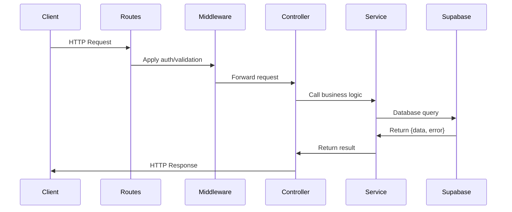

## Overview

The CONIITI 2026 backend follows a **three-layer module pattern** where each feature is organized into routes, controllers, and services. This pattern ensures clear separation of concerns and maintainable code.

## Module Structure

Each module in `src/modules/` follows this consistent structure:

```
module-name/
├── module-name.routes.ts      # Express router and endpoints
├── module-name.controller.ts  # Request/response handlers
├── module-name.service.ts     # Business logic and database
└── module-name.dto.ts         # Data validation (optional)
```

## Layer Responsibilities

### 1. Routes Layer

**Purpose:** Define HTTP endpoints and apply middleware

**Responsibilities:**
- Create Express router instance
- Define HTTP methods and paths
- Apply middleware (authentication, validation)
- Import and bind controller functions
- Export router for app registration

**Example:** `src/modules/usuario/usuario.routes.ts`

```typescript
import { Router } from 'express'
import { authMiddleware } from '../../middleware/auth.middleware'
import * as controller from './usuario.controller'

const router = Router()

// Public routes
router.post('/register', controller.registerUser)

// Protected routes (require authentication)
router.get('/perfil', authMiddleware, controller.obtenerPerfil)
router.post('/perfil', authMiddleware, controller.crearPerfil)
router.put('/perfil', authMiddleware, controller.actualizarPerfil)
router.get('/', authMiddleware, controller.obtenerUsuarios)

export default router
```

**Key patterns:**
- Use `Router()` from Express
- Import controllers with `import * as controller`
- Chain middleware before controller: `router.get(path, middleware, controller)`
- Group public and protected routes
- Export default router

### 2. Controller Layer

**Purpose:** Handle HTTP requests and responses

**Responsibilities:**
- Receive Request and Response objects
- Extract data from request (body, params, query)
- Call service layer functions
- Handle errors and send appropriate responses
- Format response data
- Set HTTP status codes

**Example:** `src/modules/evento/evento.controller.ts`

```typescript
import { Request, Response } from 'express'
import * as service from './evento.service'

export const getEventos = async (_: Request, res: Response) => {
  const { data, error } = await service.obtenerEventos()
  if (error) return res.status(400).json({ error: error.message })
  res.json(data)
}

export const postEvento = async (req: Request, res: Response) => {
  const { data, error } = await service.crearEvento(req.body)
  if (error) return res.status(403).json({ error: error.message })
  res.status(201).json(data)
}
```

**Key patterns:**
- Export named async functions
- Use typed `Request` and `Response` from Express
- Destructure `{ data, error }` from service calls
- Check for errors before sending success response
- Use appropriate HTTP status codes:
  - `200` - Success
  - `201` - Created
  - `400` - Bad Request
  - `401` - Unauthorized
  - `403` - Forbidden
  - `500` - Internal Server Error

**Complex Controller Example:** `src/modules/usuario/usuario.controller.ts:88-94`

```typescript
export const obtenerPerfil = async (req: Request, res: Response) => {
  const userId = (req as any).user.id  // From authMiddleware
  const { data, error } = await service.obtenerMiPerfil(userId)

  if (error) return res.status(400).json({ error: error.message })
  res.json(data)
}
```

This controller:
1. Extracts authenticated user ID from request
2. Calls service with user ID
3. Handles service errors
4. Returns user profile data

### 3. Service Layer

**Purpose:** Implement business logic and database operations

**Responsibilities:**
- Interact with Supabase database
- Implement business logic
- Perform data validation
- Handle database errors
- Return consistent data structures

**Example:** `src/modules/evento/evento.service.ts`

```typescript
import { supabase } from '../../config/supabase'

export const obtenerEventos = async () =>
  supabase.from('evento').select('*')

export const crearEvento = async (data: any) =>
  supabase.from('evento').insert(data)
```

**Key patterns:**
- Import appropriate Supabase client (`supabase` or `admin_supabase`)
- Export named async functions
- Use Supabase query builder
- Return Supabase response format: `{ data, error }`

**Complex Service Example:** `src/modules/usuario/usuario.service.ts`

```typescript
import { supabase } from '../../config/supabase'

export const crearPerfil = async (id: string, data: any) => {
  return await supabase.from('perfil_usuario').insert({
    id,
    ...data
  })
}

export const obtenerMiPerfil = async (id: string) => {
  return await supabase
    .from('perfil_usuario')
    .select('*')
    .eq('id', id)
    .single()
}
```

### 4. DTO Layer (Optional)

**Purpose:** Define data validation schemas

**Responsibilities:**
- Define Zod validation schemas
- Validate request data structure
- Ensure type safety
- Document expected data formats

**Example:** `src/modules/usuario/usuario.dto.ts`

```typescript
import { z } from 'zod'

export const crearPerfilSchema = z.object({
  nombres: z.string().min(1, "El nombre es obligatorio"),
  apellidos: z.string().min(1, "El apellido es obligatorio"),
  universidad: z.string().optional(),
  email: z.string().email(),
  contraseña: z.string().min(8)
})
```

## Data Flow

The typical request flow through a module:



## Complete Module Example

Here's how a complete user profile fetch works:

### 1. Route Definition

```typescript
// usuario.routes.ts
router.get('/perfil', authMiddleware, controller.obtenerPerfil)
```

### 2. Controller Handler

```typescript
// usuario.controller.ts
export const obtenerPerfil = async (req: Request, res: Response) => {
  const userId = (req as any).user.id
  const { data, error } = await service.obtenerMiPerfil(userId)
  
  if (error) return res.status(400).json({ error: error.message })
  res.json(data)
}
```

### 3. Service Logic

```typescript
// usuario.service.ts
export const obtenerMiPerfil = async (id: string) => {
  return await supabase
    .from('perfil_usuario')
    .select('*')
    .eq('id', id)
    .single()
}
```

## Creating a New Module

To add a new module to the backend:

### Step 1: Create Module Directory

```bash
mkdir src/modules/new-module
```

### Step 2: Create Service File

```typescript
// new-module.service.ts
import { supabase } from '../../config/supabase'

export const getItems = async () => {
  return await supabase.from('table_name').select('*')
}

export const createItem = async (data: any) => {
  return await supabase.from('table_name').insert(data)
}
```

### Step 3: Create Controller File

```typescript
// new-module.controller.ts
import { Request, Response } from 'express'
import * as service from './new-module.service'

export const getItems = async (_req: Request, res: Response) => {
  const { data, error } = await service.getItems()
  if (error) return res.status(400).json({ error: error.message })
  res.json(data)
}

export const createItem = async (req: Request, res: Response) => {
  const { data, error } = await service.createItem(req.body)
  if (error) return res.status(400).json({ error: error.message })
  res.status(201).json(data)
}
```

### Step 4: Create Routes File

```typescript
// new-module.routes.ts
import { Router } from 'express'
import * as controller from './new-module.controller'
import { authMiddleware } from '../../middleware/auth.middleware'

const router = Router()

router.get('/', controller.getItems)
router.post('/', authMiddleware, controller.createItem)

export default router
```

### Step 5: Register in App

```typescript
// app.ts
import newModuleRoutes from './modules/new-module/new-module.routes'

app.use('/api/new-module', newModuleRoutes)
```

## Best Practices

<AccordionGroup>
  <Accordion title="Keep Controllers Thin">
    Controllers should only handle request/response logic. Move all business logic to services.
    
    **Bad:**
    ```typescript
    export const createUser = async (req: Request, res: Response) => {
      // Validation logic
      // Database operations
      // Business rules
      // Email sending
    }
    ```
    
    **Good:**
    ```typescript
    export const createUser = async (req: Request, res: Response) => {
      const { data, error } = await service.createUser(req.body)
      if (error) return res.status(400).json({ error: error.message })
      res.status(201).json(data)
    }
    ```
  </Accordion>

  <Accordion title="Use Proper Error Handling">
    Always check for errors from services and return appropriate status codes.
    
    ```typescript
    const { data, error } = await service.doSomething()
    if (error) {
      return res.status(400).json({ error: error.message })
    }
    res.json(data)
    ```
  </Accordion>

  <Accordion title="Apply Middleware in Routes">
    Keep middleware application in the routes layer, not in controllers.
    
    ```typescript
    router.get('/protected', authMiddleware, controller.handler)
    router.post('/validate', validationMiddleware, controller.handler)
    ```
  </Accordion>

  <Accordion title="Export Named Functions">
    Use named exports for better IDE support and debugging.
    
    ```typescript
    // Good
    export const getUsers = async () => { }
    export const createUser = async () => { }
    
    // Avoid
    export default { getUsers, createUser }
    ```
  </Accordion>

  <Accordion title="Consistent Naming Conventions">
    Use consistent naming across layers:
    - Routes: HTTP verb + noun (`router.get()`, `router.post()`)
    - Controllers: verb + noun (`getUsers`, `createUser`)
    - Services: Spanish verb + noun (`obtenerUsuarios`, `crearUsuario`)
  </Accordion>
</AccordionGroup>

## Available Modules

<CardGroup cols={2}>
  <Card title="usuario" icon="user">
    User management, registration, and profile operations
  </Card>
  <Card title="evento" icon="calendar">
    Event management and listing
  </Card>
  <Card title="ponencia" icon="presentation">
    Presentation submission and management
  </Card>
  <Card title="ponente" icon="microphone">
    Speaker profiles and information
  </Card>
  <Card title="inscripcion" icon="ticket">
    Event registration management
  </Card>
</CardGroup>

## Next Steps

<CardGroup cols={2}>
  <Card title="Authentication" icon="lock" href="/development/backend/authentication">
    Implement protected routes
  </Card>
  <Card title="Supabase Integration" icon="database" href="/development/backend/supabase-integration">
    Work with database clients
  </Card>
</CardGroup>